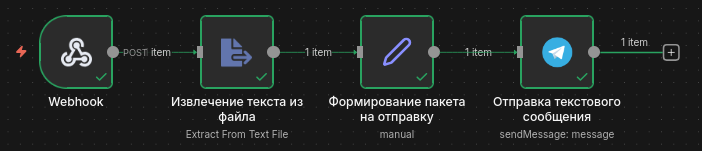

# Тестовые задания

Данный репозиторий содержит 3 тестовые задачи от DiamantVisual.
Каждое задание расположено в отдельно.
---

# Тестовое задание №1: Валидатор списка email-адресов

## Цели

Разработать скрипт на Python, который:

* принимает список email-адресов (форматы .csv или .txt);
* валидирует формат email;
* проверяет наличие MX-записей домена;
* проверяет доступность домена через WHOIS;
* выводит статус для каждого email:

  * «домен валиден»;
  * «домен отсутствует»;
  * «MX-записи отсутствуют или некорректны».

## Идея

Предварительно валидируется синтаксис email, затем извлекается домен.
Для каждого домена выполняется:

* проверка WHOIS на предмет существования и не истечения регистрации;
* проверка MX-записей через DNS.

Чтобы обеспечить высокую производительность при повторных запусках, используется кэш доменов.
Подход следует принципу "defence in depth and hard front": строгая проверка входных данных, обработка исключений на каждом уровне, минимизация сбоев.

## Пошаговое решение

1. Проверка валидности расширения входного файла.
2. Валидация формата каждого email.
3. Извлечение домена и проверка:

   * WHOIS (живой, не истёк);
   * DNS MX-записей.
4. Загрузка кэша доменов, обновление его новыми результатами проверки.
5. Обработка входного файла и генерация итогового отчёта.

## Структура

```
test_task_1/
├── main.py
├── src/
│   ├── __init__.py
│   └── emails_validation.py
├── input_data/
│   ├── input_data_csv.csv
│   └── input_data_txt.txt
├── output_data/
│   └── output_data.csv
├── cached_domains/
│   └── domains_cache.csv
└── requirements.txt
```

---

# Тестовое задание №2: Мини-интеграция с Telegram (n8n)

## Цели

Сконструировать простой n8n workflow, который:

* принимает через Webhook текстовый файл (.txt) и chat_id ТГ-аккаунта для отправки содержимого из файла;
* извлекает текст из бинарного файла;
* объединяет данные файла и тела запроса (chat_id) в единый JSON;
* отправляет полученный текст в указанный приватный ТГ-чат через ТГ-бота.

## Идея

Workflow организован следующим образом:

1. Узел "Webhook" принимает POST-запрос с .txt файлом и параметрами.
2. Узел "Извлечение текста из файла" извлекает текст из файла.
3. Узел "Формирование пакета на отправку" формирует итоговый JSON:

   ```
   {
     "chat_id": "...",
     "text": "..."
   }
   ```
4. Узел "Отправка текстового сообщения" отправляет текст в чат, используя данные предыдущего шага.

## Изображение workflow (решение)



## Структура

```
test_task_2/
├── curl_to_service
├── DiamantVisionTest_2.json
└── message_text.txt
```

---

# Тестовое задание №3

## Цели

Предложить архитектуру, которая позволит обслуживать 1200 email-адресов для аутрича 
(несколько клиентов, несколько направлений), с минимальной стоимостью инфраструктуры и 
высокой отказоустойчивостью.

В ответ включить:

* описание архитектуры;
* какие сервисы и подходы используются;
* как работает ротация и мониторинг;
* как распределяется нагрузка;
* риски и способы их закрытия; 
* примерную оценку стоимости.

## Структура

```
test_task_3/
└── about.md
```

---

# Корневая структура репозитория

```
├── test_task_1/
├── test_task_2/
├── test_task_3/
├── images/
│   └── workflow.png
├── .dockerignore
├── .gitignore
└── README.md
```

---
